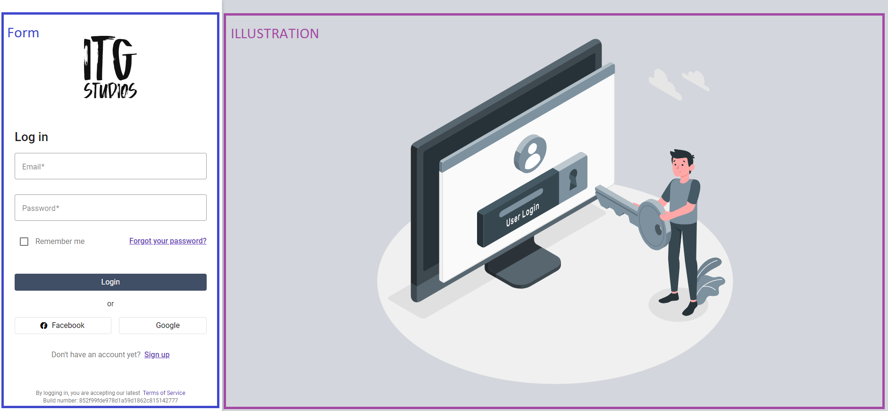

# What is content projection

As per the [Angular documentation](https://angular.io/guide/content-projection): Content projection is a pattern in
which you insert, or project, the content you want to use inside another component.

Several things to note:
Although the content is projected somewhere else, it is still part of the original component. This means that the
projected content can still access the original component's properties and methods. It's also not possible to style the
projected content from the container component, unless you use the `::ng-deep` selector. In this project you'll notice
the container style the projected content, but is done by switching the container's view encapsulation off.

## How content projection was used in this project

Each "page" has a _form_ and specific _illustration_. The form should grow and shrink columns depending on screen size,
and on small devices the illustration should be hidden.



In order to achieve the desired layout, the template looks like this:

```html

<div class="container-fluid h-100 background-color">
  <div class="row h-100">
    <div
      class="left-container offset-sm-2 offset-md-0 col-sm-8 col-md-4 col-lg-3 border-end mat-elevation-z3"
    >
      <div class="form-container">
        <div class="d-flex justify-content-center mb-8">
          <itg-logo style="width: 7rem"></itg-logo>
        </div>
        <!--The form code goes here-->
      </div>

      <div class="text-center itg-tertiary">
        <span>By logging in, you are accepting our latest &nbsp;</span>
        <a class="text-decoration-none" href="#">Terms of Service</a>
      </div>
      <div class="text-center itg-tertiary">
        Build number: 852f99fde978d1a59d1862c815142777
      </div>
    </div>
    <div class="d-none d-md-flex flex-column col-md-8 col-lg-9 h-100">
      <div
        class="px-2 mt-auto mb-auto d-flex justify-content-center align-items-center overflow-hidden rh-100"
      >
        <!--The illustration code goes here-->
      </div>
    </div>
  </div>
</div>
```

To replicate this on each page would be a lot of code duplication.

One solve would be to make this a parent component and use routing to load the correct child component. This would work,
but would require a lot of routing configuration, as the form and illustration should be showed.
Another option would be to use content projection. This would allow the form and illustration to be defined in the
parent component, and then projected into the correct place in the template.

As there are 2 pieces of content to project, 2 slots are defined in the parent component:
```html
...
    <ng-content select="[form]"></ng-content>
...

...
    <ng-content select="[illustration]"></ng-content>
...
```

Note the use of the `select` attribute. This is used to select the content to project. In this case, the content is based on _select="\[some-attribute]"_.
Another option would be to use _select=".some-css-class"_ or _select="some-html-tag"_.

All that remains is to use this component in the various pages. But I don't want to have to define some css class for projection, nor do I want to create subcomponents. 

Luckily Angular supports the syntax:
```html
<ng-container ngProjectAs="[question]">
  <p>Isn't content projection cool?</p>
</ng-container>
```

So the final login component looks like this:
```html
<itg-login-container>
  <ng-container ngProjectAs="[form]">
    <!--Omited for brevity-->
  </ng-container>

  <ng-container ngProjectAs="[illustration]">
    <!--Omited for brevity-->
  </ng-container>
</itg-login-container>
```
