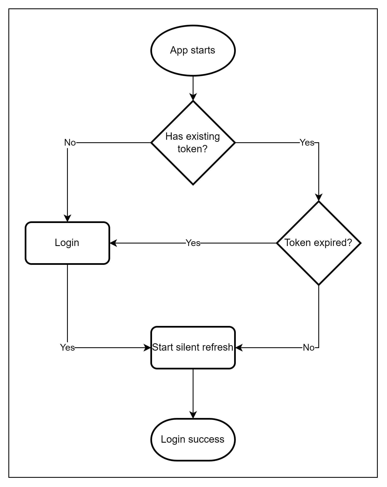
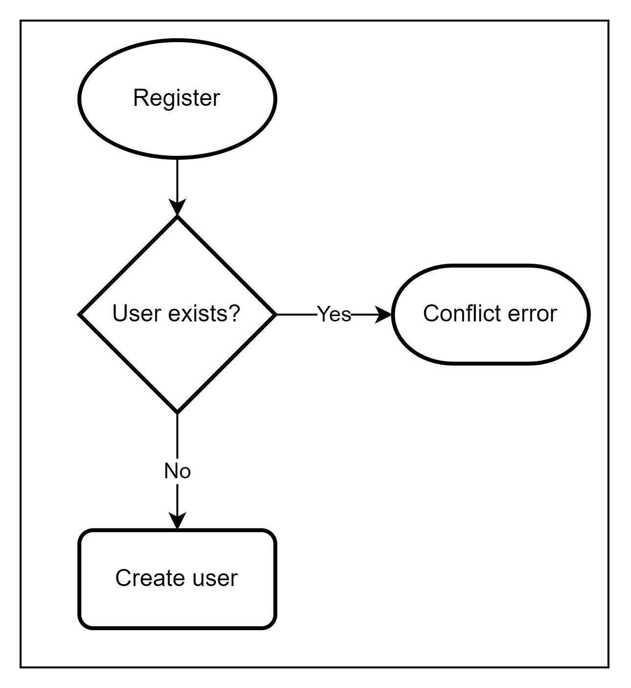
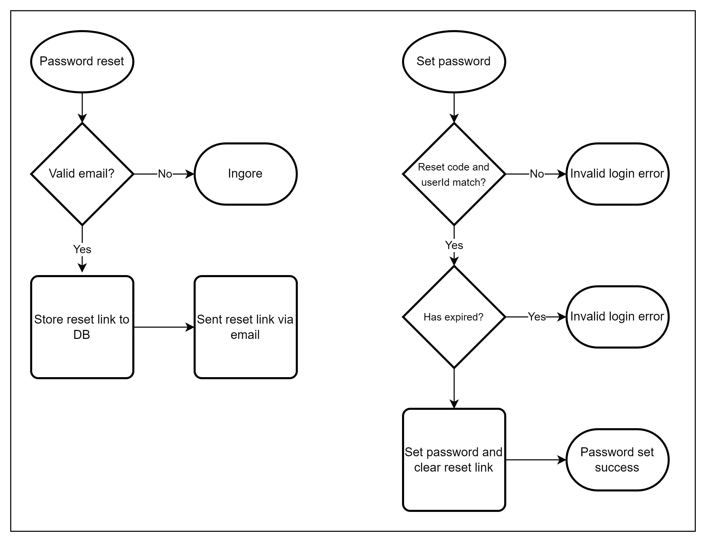

# Authentication

The authentication process is broken into 3 parts; Login, Sign up, and Reset password. Each process' flow is described
as a diagram.

## 1. Login

The user enters their email and password. If the credentials are correct, the user is logged in and redirected to the
dashboard. This starts a silent refresh flow that uses a refresh jwt and silently refreshes as long as the user is
logged in.

An improvement on this could be a dead-man flow, where the UI logs a user out if no activity is detected after some time.
If the credentials are incorrect, the user is redirected to the login page with an error message.

  

## 2. Sign up

This is when the user needs to sign up, they enter their email and password. If the email is already in use, the user is
redirected to the sign-up page with an error message. If the email is not in use, the user is redirected to the login
page with a success message.

  

## 3. Reset password
This flow is broken into 2 separate flows.
This first is doing a reset password request. The user enters their email and requests a password reset. If the email
does not exist, the request is ignored on the backend and the user never receives an email. If the email does exist, the
backend creates an encoded reset link that it persists in the database. The backend then sends an email to the user with
the reset link. The user then clicks the link and is redirected to the set password page.

The second flow is setting the password. The user enters their new password and confirms it. Assuming the passwords
match, the set password request is sent along with the reset code. If the reset code is invalid or expired, the request
will return as an InvalidLoginException. If the reset code is valid, the password is updated and the user is redirected
to the login page with a success message. The reset code is then deleted from the database.

  

